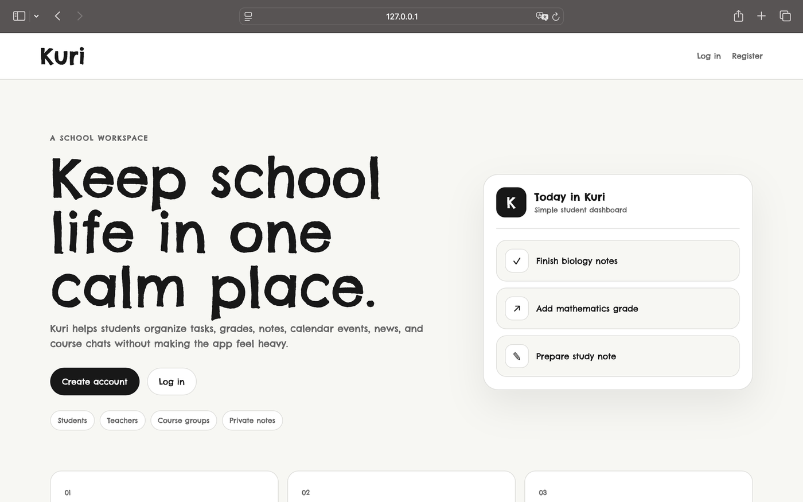
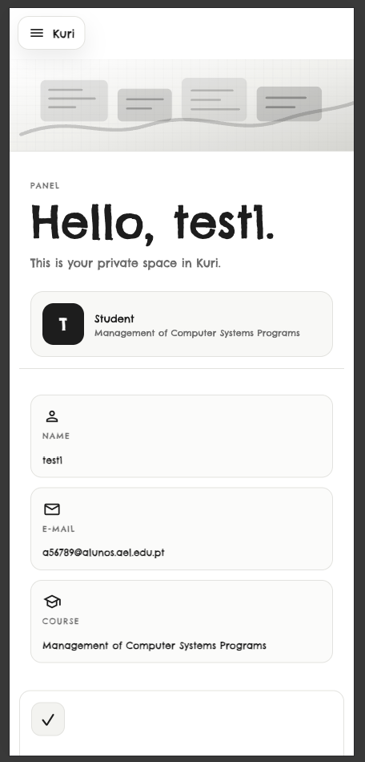
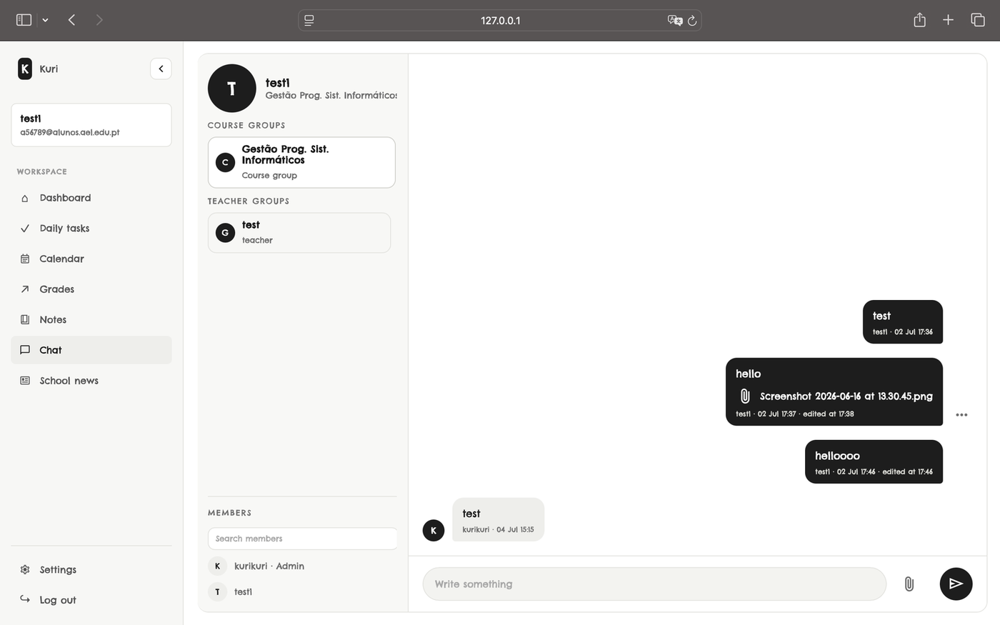
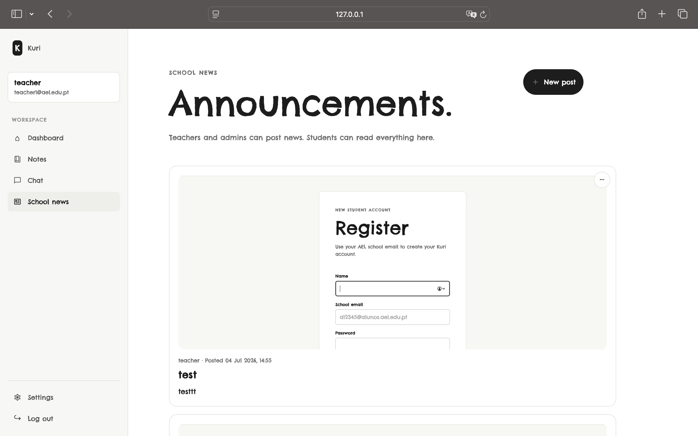
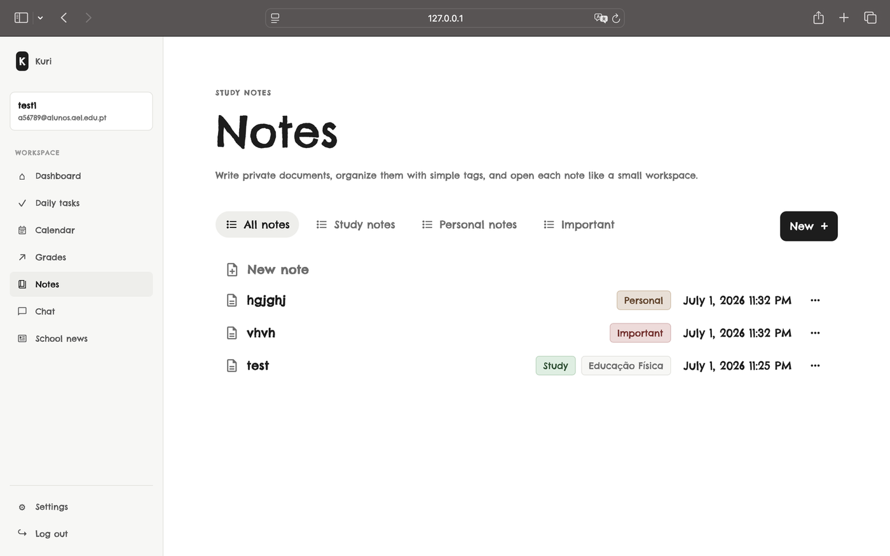
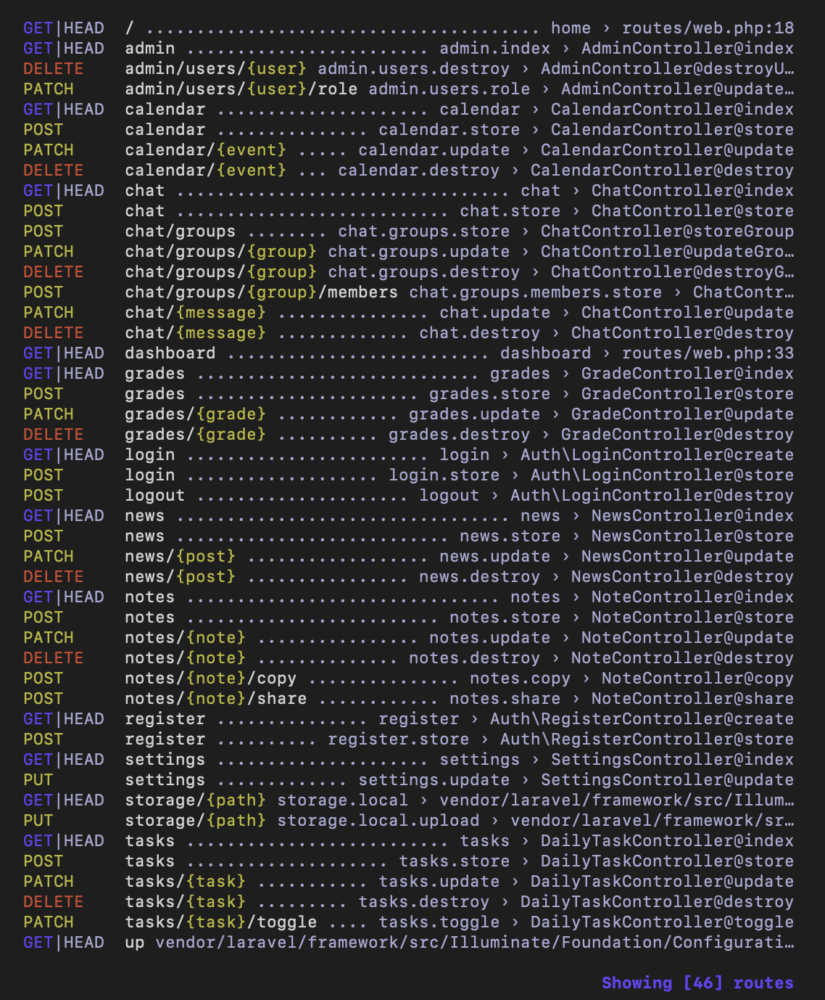
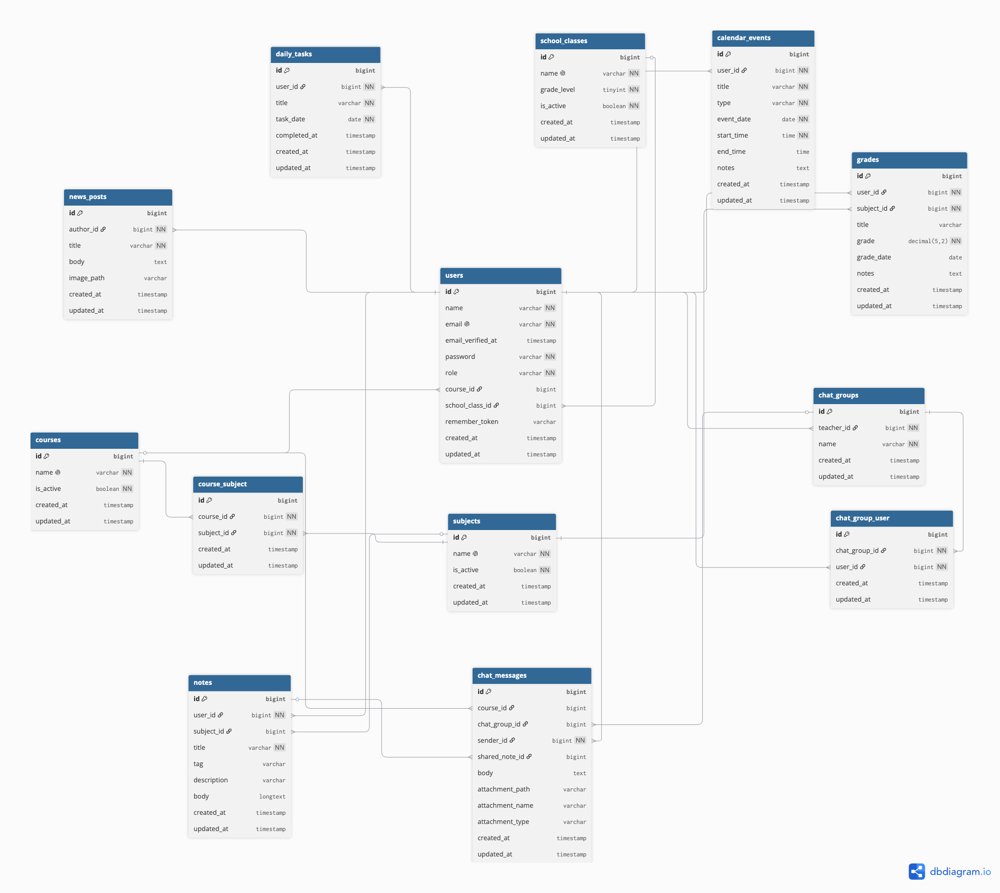

# KURI

KURI is a web-based school platform that brings common student and teacher tools into one application. It was developed as my final-year project (PAP) during my TGPSI vocational secondary education in Portugal.

<table>
  <tr>
    <td></td>
    <td></td>
  </tr>
</table>

## Features

- User registration and authentication
- Student and teacher accounts
- Personal dashboard
- Calendar
- Daily tasks
- Notes
- Grades and evaluations
- Courses and subjects
- Groups and chat
- School news
- File uploads
- User settings
- Access control and validation

<table>
  <tr>
    <td></td>
    <td></td>
    <td></td>
  </tr>
</table>

## Technologies

- PHP
- Laravel
- MySQL
- JavaScript
- HTML
- CSS
- Bootstrap

## Architecture

KURI was developed using the Laravel MVC (Model-View-Controller) architecture.

- **Models** handle interaction with the database.
- **Controllers** handle application logic and requests.
- **Blade views** handle the user interface.
- **Routes** define how requests are directed through the application.

  

## Database

The application uses MySQL as its relational database. It includes tables for users, courses, subjects, tasks, notes, evaluations, calendar events, groups, chat messages, and news.

Laravel migrations were used to create and manage the database structure.

  

## Authentication & Security

The application includes validation and access-control rules to help protect user data and ensure proper access.

The project also includes rules to prevent users from accessing or modifying data belonging to other users, as well as validation for forms, file uploads, and database entries.

## Documentation

A detailed 81 pages project report was created as part of the final-year project. It documents the project's requirements, architecture, database design, implementation, security, testing, problems encountered, and solutions.
